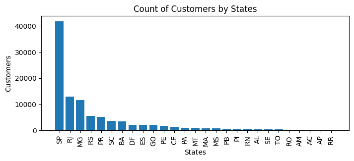
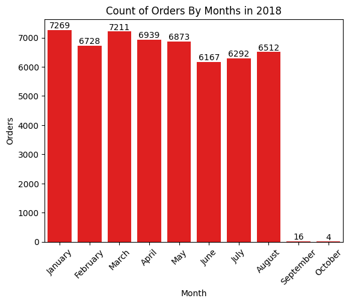
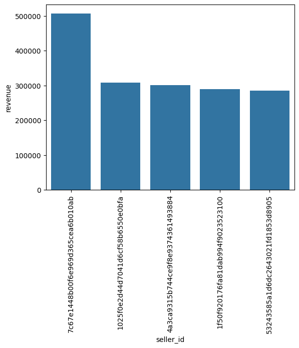
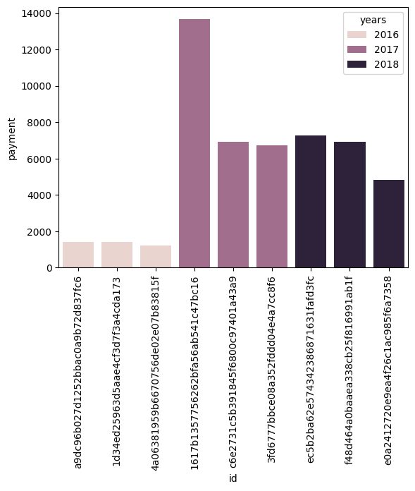

# **📊 E-commerce Data Analysis using SQL & Python**

## **📌 Project Overview**
This project analyzes **e-commerce sales data** using **SQL and Python** to extract insights into **customer behavior, product performance, and revenue trends**. By connecting to a MySQL database, executing queries, and visualizing data, this project helps businesses make data-driven decisions.

---

## **🚀 Key Features**
✅ **Customer Analysis:** Identifies unique customer locations and purchase behavior.  
✅ **Order Insights:** Tracks total orders, peak order months, and sales trends.  
✅ **Product Performance:** Determines top-selling products and revenue contribution.  
✅ **SQL Query Optimization:** Uses indexing and query structuring for efficiency.  
✅ **Data Visualization:** Uses **Matplotlib** and **Seaborn** to present insights.  

---

## **🛠️ Technologies Used**
- **SQL (MySQL)** – For querying and analyzing data.  
- **Python** – For data manipulation and visualization.  
- **Pandas & NumPy** – For handling and processing datasets.  
- **Matplotlib & Seaborn** – For visualizing sales trends.  
- **Jupyter Notebook** – For interactive data exploration.  

---

## **📂 Project Structure**
```
📂 E-commerce-Data-Analysis
│-- 📜 README.md            # Project documentation  
│-- 📜 ecommerce.ipynb      # Jupyter Notebook with SQL & Python code  
│-- 📜 queries.sql          # SQL queries used for analysis  
│-- 📜 data.csv             # Sample dataset  
│-- 📂 visualizations/      # Folder for saved graphs and charts  
```

---

## **📊 Sample SQL Queries Used**
🔹 **List all unique cities where customers are located:**  
```sql
SELECT DISTINCT customer_city FROM customers;
```
🔹 **Count total orders placed in 2017:**  
```sql
SELECT COUNT(*) FROM orders WHERE YEAR(order_date) = 2017;
```
🔹 **Find the top 5 best-selling products:**  
```sql
SELECT product_id, COUNT(*) AS total_sales 
FROM orders 
GROUP BY product_id 
ORDER BY total_sales DESC 
LIMIT 5;
```

---

## **📊 Sample Visualizations**

### **Customers by State**


### **Orders by Month**


### **Revenue by each Seller**


### **Customer Purchase Frequency**


---

## **📥 How to Run the Project**
1️⃣ Clone the repository:  
```sh
git clone https://github.com/Ayush-Pandey0704/E-commerce-Data-Analysis.git
```
2️⃣ Install required libraries:  
```sh
pip install pandas numpy matplotlib seaborn mysql-connector-python
```
3️⃣ Connect to MySQL database and run `ecommerce.ipynb`.  

---

## **📝 Conclusion**
This project provides valuable insights into **customer behavior, sales trends, and product performance** in an e-commerce business. It demonstrates the power of **SQL for data extraction** and **Python for analysis and visualization**.  

---

## **🔗 Connect with Me**
👤 **Ayush Pandey**  
📧 **work.ayushpandey@gmail.com**  
🔗 **[LinkedIn Profile](https://linkedin.com/in/ayush-pandey-30462a331)**  

---
